# HealthPath Malaysia ERD

This ERD matches the PostgreSQL schema used by the application. Public Malaysian datasets are separated from anonymous session data. There is no account or personally identifying user table.

```mermaid
erDiagram
    DATA_SOURCES ||--o{ MORTALITY_DATA : provides
    DATA_SOURCES ||--o{ ANNUAL_DEATHS_BY_STATE : provides
    DATA_SOURCES ||--o{ POPULATION_BY_STATE : provides
    DATA_SOURCES ||--o{ SCREENINGS_BY_STATE : provides
    DATA_SOURCES ||--o{ REFERENCE_VALUES : provides
    DATA_SOURCES ||--o{ RECOMMENDATIONS : supports

    CAUSES_OF_DEATH ||--o{ MORTALITY_DATA : classifies
    HEALTH_INDICATORS ||--o{ REFERENCE_VALUES : measures
    HEALTH_INDICATORS ||--o{ PRIORITISATION_RULES : controls
    HEALTH_INDICATORS ||--o{ RECOMMENDATIONS : suggests

    HEALTH_INDICATORS ||--o{ INDICATOR_CAUSE_LINK : links
    CAUSES_OF_DEATH ||--o{ INDICATOR_CAUSE_LINK : links
    PRIORITISATION_RULES ||--o{ RULE_RECOMMENDATION : maps
    RECOMMENDATIONS ||--o{ RULE_RECOMMENDATION : maps

    USER_SESSIONS ||--o| USER_PROFILES : has
    USER_SESSIONS ||--o| ASSESSMENT_RESULTS : generates
    USER_SESSIONS ||--o{ USER_GOALS : tracks
    RECOMMENDATIONS ||--o{ USER_GOALS : becomes

    DATA_SOURCES {
        text source_id PK
        text organisation
        text dataset_name
        integer publication_year
        text source_url
        text license
    }

    CAUSES_OF_DEATH {
        text cause_id PK
        text cause_name UK
        text category
        text description
    }

    MORTALITY_DATA {
        text mortality_id PK
        text cause_id FK
        integer year
        text age_group
        text gender
        text ethnicity
        text state
        integer death_count
        decimal measure_value
        text measure_unit
        text source_id FK
    }

    ANNUAL_DEATHS_BY_STATE {
        text death_id PK
        text source_id FK
        integer year
        text state
        text sex
        text ethnicity
        integer death_count
    }

    POPULATION_BY_STATE {
        text population_id PK
        text source_id FK
        integer year
        text state
        text sex
        text age_group
        text ethnicity
        decimal population_thousands
    }

    SCREENINGS_BY_STATE {
        text screening_id PK
        text source_id FK
        text date
        text state
        integer screening_count
    }

    HEALTH_INDICATORS {
        text indicator_id PK
        text indicator_name UK
        text description
        text default_unit
    }

    REFERENCE_VALUES {
        text reference_id PK
        text indicator_id FK
        text age_group
        text gender
        text state
        decimal reference_value
        text unit
        integer reference_year
        text source_id FK
    }

    PRIORITISATION_RULES {
        text rule_id PK
        text indicator_id FK
        text profile_factor
        text condition_operator
        text condition_value
        integer priority_score
        integer active
    }

    RECOMMENDATIONS {
        text recommendation_id PK
        text indicator_id FK
        text action_title
        text action_description
        text first_step
        text source_id FK
    }

    INDICATOR_CAUSE_LINK {
        text indicator_id PK, FK
        text cause_id PK, FK
        text relationship_note
    }

    RULE_RECOMMENDATION {
        text rule_id PK, FK
        text recommendation_id PK, FK
    }

    USER_SESSIONS {
        text session_id PK
        boolean consent_accepted
        timestamp created_at
        timestamp last_seen_at
    }

    USER_PROFILES {
        text session_id PK, FK
        jsonb profile_json
        timestamp updated_at
    }

    ASSESSMENT_RESULTS {
        text session_id PK, FK
        jsonb result_json
        timestamp updated_at
    }

    USER_GOALS {
        bigint goal_id PK
        text session_id FK
        text recommendation_id FK
        integer progress
        boolean complete
        text start_date
        timestamp updated_at
    }
```

## Main relationship explanation

- `DATA_SOURCES` is the provenance parent for all imported public datasets and reference recommendations.
- `HEALTH_INDICATORS` connects reference values, prioritisation rules and preventive recommendations.
- `INDICATOR_CAUSE_LINK` resolves the many-to-many relationship between health indicators and causes of death.
- `RULE_RECOMMENDATION` resolves the many-to-many relationship between prioritisation rules and recommendations.
- `USER_SESSIONS` is an anonymous temporary session. It has at most one profile and one generated assessment result, but can have many goals.
- `USER_GOALS` links a session to a recommendation and stores progress/completion updates.
